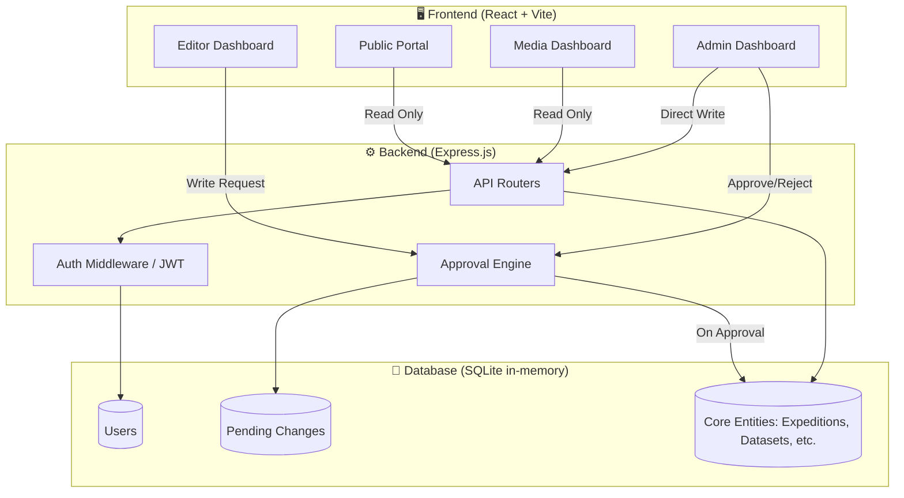

---

<div align="center">

# 🧊 PRISM
**Polar Research & Information System for Media**

[](https://react.dev/)
[](https://nodejs.org/)
[](https://vitejs.dev/)
[](https://tailwindcss.com/)
[](https://sqlite.org/)

*A centralized, role-based unified portal for the National Centre for Polar and Ocean Research (NCPOR).*

[Live Demo](#-getting-started) · [Architecture](#-system-architecture) · [Features](#-key-features) · [Setup Guide](#-getting-started)

</div>

---

## 📋 Table of Contents
- [Overview](#-overview)
- [The Problem](#-the-problem)
- [Our Solution](#-our-solution)
- [System Architecture](#-system-architecture)
- [Key Features](#-key-features)
- [Role-Based Access Control (RBAC)](#-role-based-access-control-rbac)
- [Tech Stack](#-tech-stack)
- [Project Structure](#-project-structure)
- [Getting Started](#-getting-started)
- [API Routes](#-api-routes)
- [License](#-license)

---

## 🌐 Overview
**PRISM** is a full-stack, dynamic web portal designed to manage, organize, and publicize the extensive research, datasets, publications, and expeditions conducted by the **National Centre for Polar and Ocean Research (NCPOR)**. 

The platform features a rigorous **3-tier Role-Based Access Control (RBAC)** system with a built-in editorial approval workflow, ensuring that sensitive scientific data is verified by administrators before being made accessible to the public and media.

---

## 🚨 The Problem
<div align="center">

| Problem | Impact |
|---------|--------|
| 🗄️ **Decentralized Data** | Research, datasets, and media are scattered across different non-unified systems. |
| 🛡️ **Lack of Content Moderation** | Direct database writes by contributors can lead to unverified or sensitive data leaks. |
| 📰 **Media Inaccessibility** | The public and journalists struggle to find verified, curated information regarding polar expeditions. |
| ⚙️ **Rigid Infrastructure** | Outdated web portals that are difficult to update, scale, or navigate. |

</div>

---

## 💡 Our Solution
PRISM operates on a highly secure, tiered content-management architecture:

```
┌──────────────────────────────────────────────────────────────────┐
│                             PRISM                                │
├──────────────────┬──────────────────┬────────────────────────────┤
│   ✍️ EDITORS      │   🛡️ ADMINS      │    📰 MEDIA / PUBLIC       │
│                  │                  │                            │
│  Researchers &   │  System          │  Journalists &             │
│  scientists      │  Administrators  │  General Public            │
│  submit data,    │  review, approve │  search and view           │
│  publications,   │  or reject       │  approved, published       │
│  and media.      │  editor changes. │  content via the portal.   │
├──────────────────┼──────────────────┼────────────────────────────┤
│  Drafting tools  │  Approval Queue  │  Unified Search            │
│  Media uploads   │  User Management │  Dataset Downloads         │
│  Status tracking │  Full CRUD       │  Read-Only Access          │
└──────────────────┴──────────────────┴────────────────────────────┘
```

---

## 🏗️ System Architecture



**Data Flow (Editor Workflow):**
1. **Editor** submits a new Dataset or edits an Expedition.
2. The backend intercepts the request and saves the payload to the **`pending_changes`** table.
3. **Admin** reviews the pending queue.
4. If approved, the backend automatically merges the payload into the **Core Entities** tables.
5. The content becomes visible to the **Media/Public**.

---

## ✨ Key Features

### 🏠 Public Portal
- **Dynamic Landing Page:** Visually engaging landing page showcasing NCPOR's mission, live system statistics, and the latest news articles.
- **Unified Search:** A powerful search engine to query across all public data, enabling researchers and journalists to quickly find datasets or publications.
- **Responsive Design:** Fully responsive layout built with Tailwind CSS, ensuring accessibility across mobile and desktop devices.

### ⛴️ Expedition Management
- **Expedition Lifecycle:** Track research expeditions across various regions (Antarctic, Arctic, Himalayas, Southern Ocean).
- **Interactive Details:** View detailed expedition metadata including start/end dates, participating scientists, and associated scientific publications.
- **Data Linkage:** Automatically links raw datasets and media items to their parent expeditions for a unified research view.

### 📊 Data Repository & Datasets
- **Open Data Access:** A dedicated module for exploring and downloading raw scientific datasets.
- **Metadata Management:** Structured metadata tracking (discipline, format, size, licensing) ensures data meets global scientific sharing standards (like FAIR principles).
- **Download Tracking:** System logs dataset downloads to track impact and usage statistics for NCPOR metrics.

### 📚 Research Publications
- **Centralized Library:** Curated repository of scientific papers, technical reports, and newsletters generated from NCPOR research.
- **Citation Integration:** Detailed author attribution, publication years, and external DOI links.

### 📸 Media Library
- **Visual Archives:** A rich gallery of photos and videos documenting polar expeditions and base stations (Bharati, Maitri, Himadri).
- **Tagging System:** Media items are categorized with specific tags for quick filtering by journalists and media agencies.

### 📰 Media Dashboard (`/portal`)
- **Read-Only Environment:** A tailored interface specifically for journalists and the public.
- **Strict Access Control:** Media users cannot access the admin backend, preventing accidental data modifications or leaks of unverified content.

### ✍️ Editor Dashboard & Content Studio (`/admin/my-submissions`)
- **Content Studio:** A centralized, form-driven interface for Editors (researchers and scientists) to draft new content (News, Events, Datasets, etc.).
- **Submission Tracking:** Real-time status updates (Pending, Approved, Rejected) for all submitted changes.
- **Review Notes:** View Admin feedback on rejected submissions directly within the dashboard to facilitate quick corrections.

### 🛡️ Admin Panel (`/admin`)
- **Pending Approvals Queue:** A comprehensive inbox where Admins review raw JSON payloads submitted by Editors. Admins can approve (which commits the data to the DB) or reject with a note.
- **System Dashboard:** Live overview statistics on total datasets, active expeditions, media items, and download logs.
- **User Management:** Full CRUD capabilities for system users, including role assignment and access revocation.

---

## 🔐 Role-Based Access Control (RBAC)

PRISM utilizes a strict 3-role hierarchy enforced via JWT HTTP-only cookies and backend middleware:

| Role | Permissions | Dashboard Access |
|------|-------------|------------------|
| **ADMIN** | Full system control. Can bypass approvals, manage users, and approve editor submissions. | Full Admin Panel |
| **EDITOR** | Can create/update content, but all changes go to the `pending_changes` queue for Admin approval. | Content Studio, Submissions |
| **MEDIA** | Read-only access to published content. Cannot access the admin backend. | Media Portal |

*Note: New user registrations default to the `MEDIA` role.*

---

## 💻 Tech Stack

<div align="center">

| Layer | Technology | Purpose |
|-------|-----------|---------|
| **Frontend** | React 18, Vite | High-performance client-side rendering |
| **Styling** | Tailwind CSS | Utility-first, responsive design system |
| **Routing** | React Router v6 | Client-side routing and protected routes |
| **Backend** | Node.js, Express.js | REST API, Business logic, RBAC middleware |
| **Database** | SQLite (`sql.js`) | In-memory database with fast file-syncing |
| **Auth** | JWT, bcryptjs | Secure, stateless authentication via `httpOnly` cookies |

</div>

---

## 📂 Project Structure

```text
PRISM/
├── backend/                  ← ⚙️ Express API Server
│   ├── prisma/
│   │   └── seed.js           # Database seeding (Demo users & data)
│   ├── src/
│   │   ├── config/           # DB schema, tables, and roles setup
│   │   ├── middleware/       # JWT Auth and RBAC enforcers
│   │   ├── routes/           # API Endpoints (approvals, auth, datasets, etc.)
│   │   └── app.js            # Express app configuration
│   └── package.json
│
└── frontend/                 ← 🖥️ React SPA
    ├── src/
    │   ├── api/              # Axios API client setup
    │   ├── components/       # Reusable UI components
    │   ├── layouts/          # AdminLayout, PublicLayout
    │   ├── pages/
    │   │   ├── admin/        # Dashboards, Content Studio, Approvals
    │   │   └── public/       # Landing, Expeditions, Search
    │   ├── App.jsx           # Routing tree
    │   └── index.css         # Tailwind directives & theme
    ├── tailwind.config.js
    ├── vite.config.js
    └── package.json
```

---

## 🚀 Getting Started

### Prerequisites
- **Node.js** (v18 or higher)
- **npm** (v9 or higher)

### Step 1 — Clone the Repository
```bash
git clone https://github.com/prathamb9/PRISM.git
cd PRISM
```

### Step 2 — Backend Setup
```bash
cd backend
npm install

# Seed the database with demo data (Admin, Editor, Media accounts)
node prisma/seed.js

# Start the API server (runs on port 3000)
npm start
```

### Step 3 — Frontend Setup
Open a new terminal window:
```bash
cd frontend
npm install

# Start the Vite development server (runs on port 5173)
npm run dev
```

### Step 4 — Login and Test
Visit `http://localhost:5173/login` in your browser. Use the provided "Quick Login" buttons to test the different user roles:
- **Admin:** `admin@ncpor.gov.in` (Password: `password123`)
- **Editor:** `editor@ncpor.gov.in` (Password: `password123`)
- **Media:** `media@ncpor.gov.in` (Password: `password123`)

---

## 🔌 API Routes

All backend routes are prefixed with `/api/v1`.

| Route | Role Access | Description |
|-------|-------------|-------------|
| `/auth/login` | Public | Authenticate user and set JWT cookie |
| `/auth/me` | All | Get current user session data |
| `/approvals` | Admin | GET pending queue |
| `/approvals/:id/approve`| Admin | Approve and commit an Editor's changes |
| `/approvals/my` | Editor | View status of own submissions |
| `/expeditions` | Media (GET), Editor/Admin (POST/PUT) | Manage research expeditions |
| `/datasets` | Media (GET), Editor/Admin (POST/PUT) | Manage datasets |
| `/stats/admin` | Admin/Editor | Get system statistics for the dashboard |

---

## 📄 License
This project is licensed under the MIT License — see the [LICENSE](LICENSE) file for details.

---

<div align="center">

**PRISM** · *Unified Research & Information Portal*

</div>
